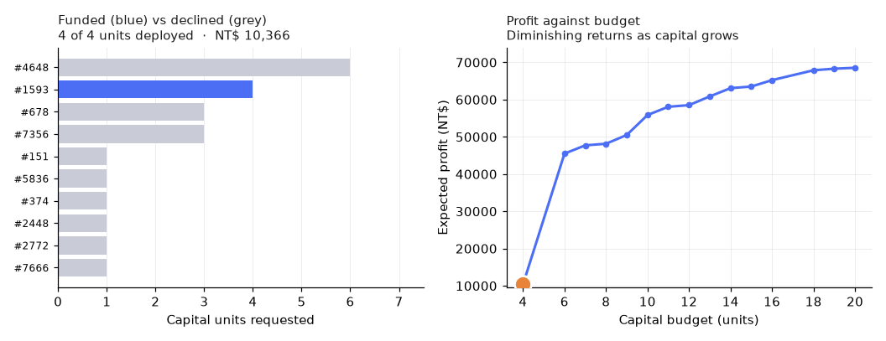

# Quantum-Assisted Loan-Portfolio Allocator

[](https://github.com/Dexterous-Ruler/quantum-loan-portfolio-allocator/actions/workflows/ci.yml)

**Team ASTITWA — Tanishq Aryan**



*Capital budget sweeps up and down; the funded portfolio (blue) re-optimises and the marker
tracks its position on the profit curve.*

**Hackathon theme #25 — Portfolio / resource allocation optimizer.**
*AI predicts returns from history → QAOA picks the best subset under a budget constraint →
live demo: enter a budget, get the optimized selection.*

An ML model scores real credit-card accounts for default risk; those calibrated probabilities
become the coefficients of a QUBO; QAOA allocates a fixed capital budget across the book.

## The architecture point

In most hybrid hackathon projects the AI and quantum parts run **in parallel** — train a
classifier, then train a quantum classifier on the same task and compare. Two demos bolted
together.

Here they run **in series**:

```
30,000 Taiwanese credit-card accounts
      ↓
calibrated GBM  →  P(default) per customer
      ↓
EV = P(repay)·interest − P(default)·LGD·exposure   ← ML output becomes objective coefficients
      ↓
QUBO: max Σ EV·x − γ·concentration(x) − λ·parity_gap(x)²   s.t.  Σ units·x ≤ budget
      ↓
Ising Hamiltonian  →  QAOA ansatz  →  measured portfolio
```

The classifier's output literally parameterises the cost Hamiltonian. Remove the AI and there
is no optimisation problem to solve.

## The four deliverables

| # | Deliverable | Where |
| --- | --- | --- |
| 1 | Working AI model | [`src/ai_model.py`](src/ai_model.py) — calibrated GBM + tuned logistic-regression baseline |
| 2 | One small quantum module | [`src/solvers.py`](src/solvers.py) — QAOA on the portfolio QUBO, 10–16 qubits, simulator |
| 3 | Live demo | [`app.py`](app.py) — Streamlit; budget slider re-optimises the loan book live |
| 4 | 1-page comparison | [`DELIVERABLE_4.html`](DELIVERABLE_4.html) — the literal one-pager, print to PDF. [`DELIVERABLE_4.md`](DELIVERABLE_4.md) is the long-form version |

Both Deliverable-4 documents are **generated from the measured CSVs** — no number in either
is typed by hand, so the page cannot drift from the experiment.

Supporting material: [`PRESENTATION.pptx`](PRESENTATION.pptx) (7-slide deck, also generated
from the artifacts) and [`PITCH.md`](PITCH.md) (3-minute demo script plus the questions a
quantum-literate judge will ask, with answers).

```bash
node src/make_deck.js && python src/qa_deck.py
```

`qa_deck.py` checks the deck for off-slide shapes, tight margins, overlapping text boxes and
text that will not fit its container — this machine has no LibreOffice, so the deck cannot be
rendered to images for visual inspection and the geometry is checked numerically instead.

Deliverable 2 is deliberately **one** module. The brief says "a single, well-scoped quantum
component", and *Feasibility* rewards being well-scoped — a second quantum component would cost
points, not earn them.

## Setup

```bash
py -3.14 -m venv .venv
```

```bash
.venv/Scripts/python.exe -m pip install -r requirements.txt
```

Rebuild every deliverable end to end (~40 min, dominated by the benchmark and ablations):

```bash
.venv/Scripts/python.exe run_all.py
```

Regenerate only figures and pages from existing results (~20 s):

```bash
.venv/Scripts/python.exe run_all.py --fast
```

Launch the demo:

```bash
.venv/Scripts/streamlit run app.py
```

## Tests

```bash
.venv/Scripts/python.exe -m pytest tests -q
```

22 tests. The fast 19 run in ~20 s; three more exercise the QAOA solver and are marked `slow`
(`pytest tests -m slow`). The load-bearing one is
`test_bruteforce_matches_qubo_diagonalisation` — if the converter's penalty weights were
wrong, exhaustive enumeration and exact diagonalisation of the QUBO would disagree and every
downstream number in this repo would be meaningless.

CI additionally runs both generators from a clean checkout, so a page that cannot be rebuilt
from the committed evidence fails the build. It reports numeric drift as a notice rather than
an error: `DELIVERABLE_4.html` embeds matplotlib PNGs whose bytes differ between the Linux
runner and the Windows machine these were generated on, so a strict byte-comparison would
fail on every run regardless of correctness. Byte-level reproducibility is verified locally —
a fresh clone regenerates identical output.

## What we took from comparable work

We surveyed the Qiskit Finance `PortfolioOptimization` tutorial, IBM's Quantum Challenge
portfolio notebooks, and the strongest QAOA portfolio repositories on GitHub before finalising.

**Adopted — a genuine risk term.** The objective was expected value under a budget: a knapsack,
not a portfolio. The canonical mean-variance formulation pairs a linear return term with a
quadratic risk term, so we added a Herfindahl penalty on capital concentrated in one customer
segment. Segment concentration limits are how credit books are really managed — accounts in a
segment default together — and the penalty introduces ZZ couplings between same-segment
accounts at **zero extra qubits**.

**Tested and rejected — CVaR aggregation.** Barkoutsos et al. (*Quantum* **4**, 256 (2020))
report CVaR aggregation converging faster and better on every problem they tested, and it is
what comparable repos use. We measured it over 24 runs per setting: the best α improved the
approximation ratio by +0.0020 against a within-cell scatter of 0.0219 — roughly 4× smaller
than its own noise floor. We kept the default. `src/cvar_ablation.py` has the numbers.

## The two numbers we invented

The dataset has no interest rate and no recovery rate, so the 18% APR and 60% LGD in
[`src/data.py`](src/data.py) are assumptions, not data. `src/sensitivity.py` tests what that
costs. Two results: the portfolio depends **only on the ratio ρ = LGD/APR**, not on either
number individually (a knapsack's argmax is invariant under positive scaling of the objective —
verified empirically over 24 rescaling checks); and holding the pool fixed, a ±20% error in ρ
leaves 88% of the portfolio unchanged. The *screening* step in front of the optimiser is far
more sensitive than the allocation itself.

## Hardware readiness

The brief scopes us to a simulator, but "would this run on a real device?" has a measurable
answer. `src/noise_ablation.py` sweeps a depolarizing two-qubit gate error and reports the
error rate at which QAOA's approximation ratio falls below the classical heuristic — i.e. the
gate fidelity this circuit would need to be worth running. Noisy simulation is ~24× slower
than noiseless, so the sweep uses 12 qubits and p=1.

## Design decisions worth defending to a judge

**Why quantum here at all?** Subset selection under a budget is a 0-1 knapsack — weakly
NP-hard, natively binary, natively quadratic once the fairness term is included. It maps to an
Ising Hamiltonian whose ground state *is* the answer. This is categorically different from
running a quantum kernel on four PCA components, where the kernel is a similarity function
nobody can motivate. Expect the question and answer it before it is asked.

**Why the budget is the qubit bottleneck.** The capital constraint is an *inequality*, so
`QuadraticProgramToQubo` introduces an integer slack variable and binary-expands it, costing
`ceil(log2(budget+1))` extra qubits. Discretising capital into coarse units is what keeps the
instance simulable. Qubit count is `n + ceil(log2(budget+1))` — the pool size plus the binary
expansion of the budget slack, typically `n + 4`.

**Why fairness is a penalty, not a constraint.** A second inequality constraint would add more
slack qubits. A squared parity gap folds into the objective at **zero** qubit cost — and it is
what makes the objective genuinely quadratic, producing real ZZ couplings between applicants of
opposite groups. A plain knapsack objective would be linear.

**Why shot-based sampling, not exact statevector expectation.** Measurement sampling is part of
the quantum concept being demonstrated, and it produces the ranked distribution of near-optimal
portfolios — something a single MILP optimum structurally cannot provide.

**Why we report 3 QAOA seeds per cell, not 1.** QAOA is stochastic in two independent ways:
which instance you drew, and which seed the sampler and optimiser started from. Running one
seed per cell confounds them. We learned this the hard way — an early single-seed benchmark
ranked `p=2` clearly best; re-running the same code with different transpilation ranked `p=2`
clearly *worst*. The spread within a single (instance, depth) cell is as large as the spread
between depths, so **no depth is meaningfully best at this scale** and any table claiming one
is reporting noise.

## About the dataset

[UCI "Default of Credit Card Clients"](https://archive.ics.uci.edu/dataset/350/default+of+credit+card+clients)
— 30,000 real Taiwanese credit-card accounts from April–September 2005, 23 predictors, with a
**real 22.1% default rate**. Downloaded on first run by [`src/data.py`](src/data.py).

**We started on UCI Statlog (German Credit) and moved off it deliberately.** It is the usual
credit-scoring benchmark, but:

| | German Credit | This dataset |
| --- | --- | --- |
| Rows | 1,000 | **30,000** |
| Vintage | 1973–75 | **2005** |
| Default rate | 30% — a *stratified over-sample*, 700/300 by construction | **22.1%, real** |
| Protected attribute | Sex **not recoverable** | Sex coded unambiguously |

The last row decided it. Grömping (2019), *South German Credit Data: Correcting a Widely Used
Data Set* (Report 4/2019, Beuth University of Applied Sciences Berlin), shows German Credit's
published coding is wrong in places: male singles and female non-singles share code `A92`, and
in the published file `A95` (female:single) has **zero rows** — so any "female" group is a mixed
bag, and a fairness result computed on it measures nothing. Most published fairness work on that
dataset uses exactly this variable.

The over-sampled base rate mattered too: it inflated every expected-value figure, so the money
was never realistic. Here it is.

**Modelling choices this dataset forces.** It is revolving credit, so exposure at default is the
outstanding balance, not the credit limit — we use the latest statement balance clipped to
`[0, limit]`. Using the limit would overstate every position by roughly an order of magnitude.
`SEX` and the `group` label derived from it are dropped from the model's features so the
classifier cannot condition on sex directly.

**Still imperfect, and worth saying:** it is one bank, one country, one six-month window in 2005,
and the segment used for the concentration term (education band) is a proxy for an industry
sector rather than the real thing.

## Honest limitations

- **QAOA is orders of magnitude slower than exhaustive classical search at this size.** We do
  not claim a speed advantage; we measure the gap and show where the method stops being simulable.
- Beyond ~20 qubits the statevector simulation falls off a cliff (28 qubits = 4.3 GB).
- The fairness term demonstrates the *mechanism* of a parity-constrained allocator. It is not a
  finding about lending discrimination in Taiwan in 2005.
- The concentration term uses education band as the customer segment, which is a proxy for a
  real industry-sector exposure rather than the thing itself.
- The 18% APR and 60% LGD are assumptions. Only their ratio matters, and we measure the
  sensitivity to it rather than asserting the numbers are right.

## Stack

Pinned deliberately — `qiskit-optimization` requires `qiskit<3`, and QAOA/COBYLA moved into
`qiskit_optimization` in 0.7.0, so tutorials importing them from `qiskit_algorithms` will fail.

```
qiskit==2.5.2   qiskit-aer==0.17.2   qiskit-optimization==0.7.0   scikit-learn   streamlit
```

Data: [UCI Default of Credit Card Clients](https://archive.ics.uci.edu/dataset/350/default+of+credit+card+clients)
(30,000 accounts, 23 predictors, Taiwan 2005), downloaded on first run to `data/`.
`xlrd` is required to read the published `.xls`.
